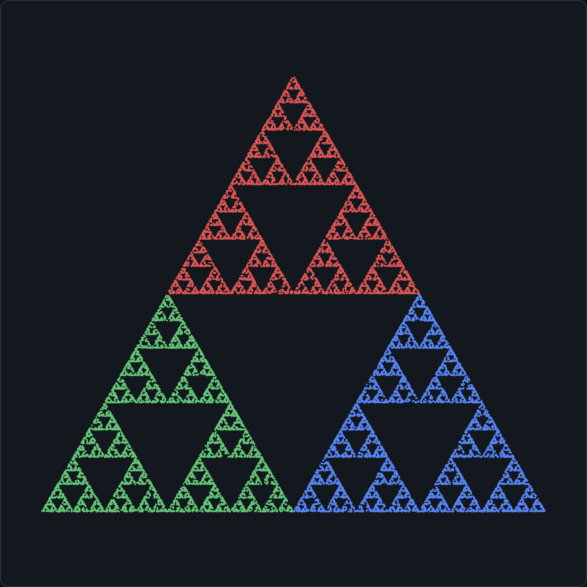
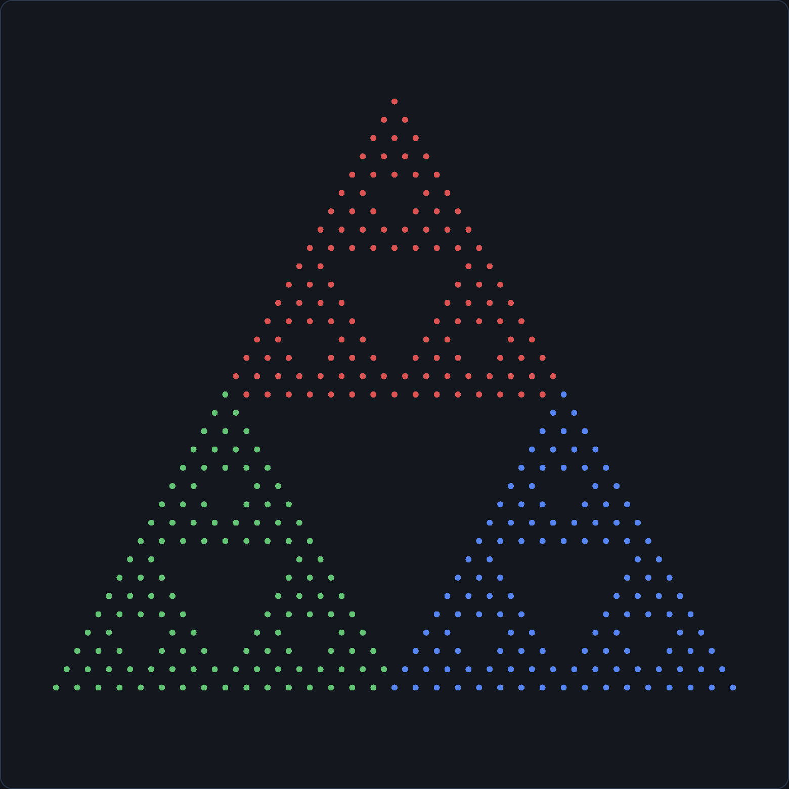
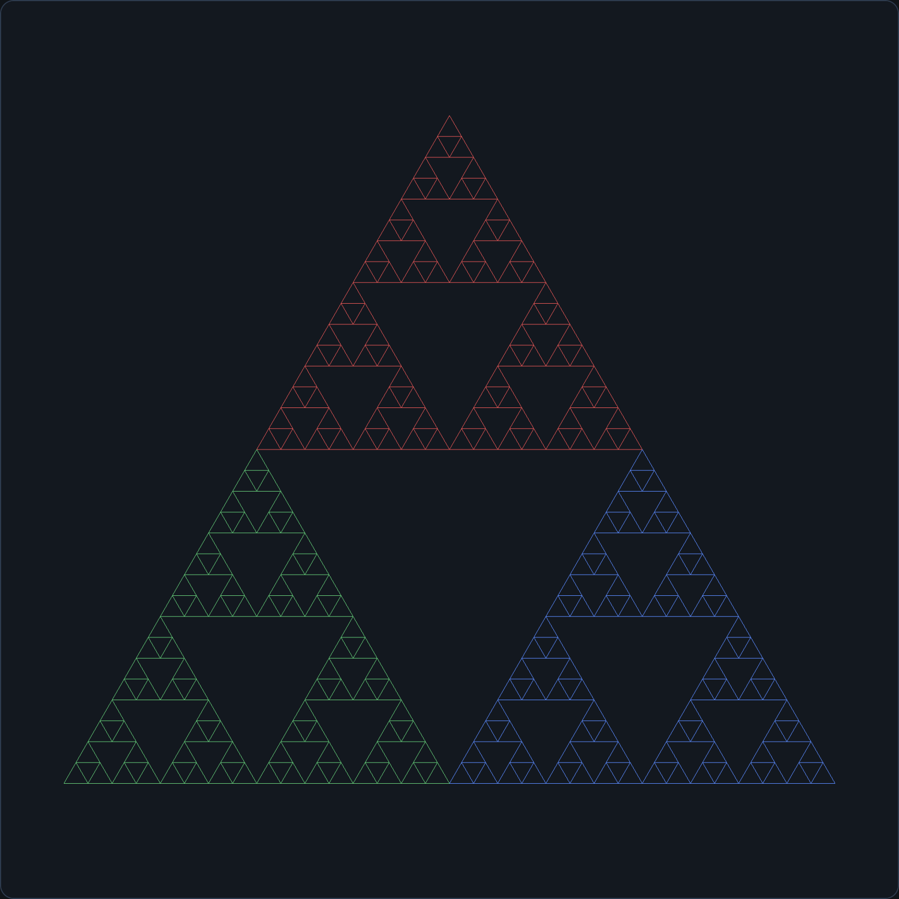
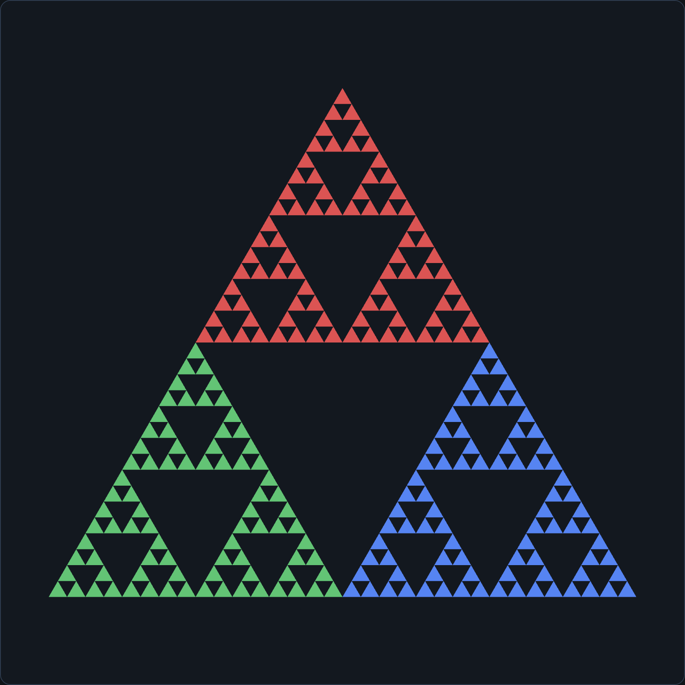
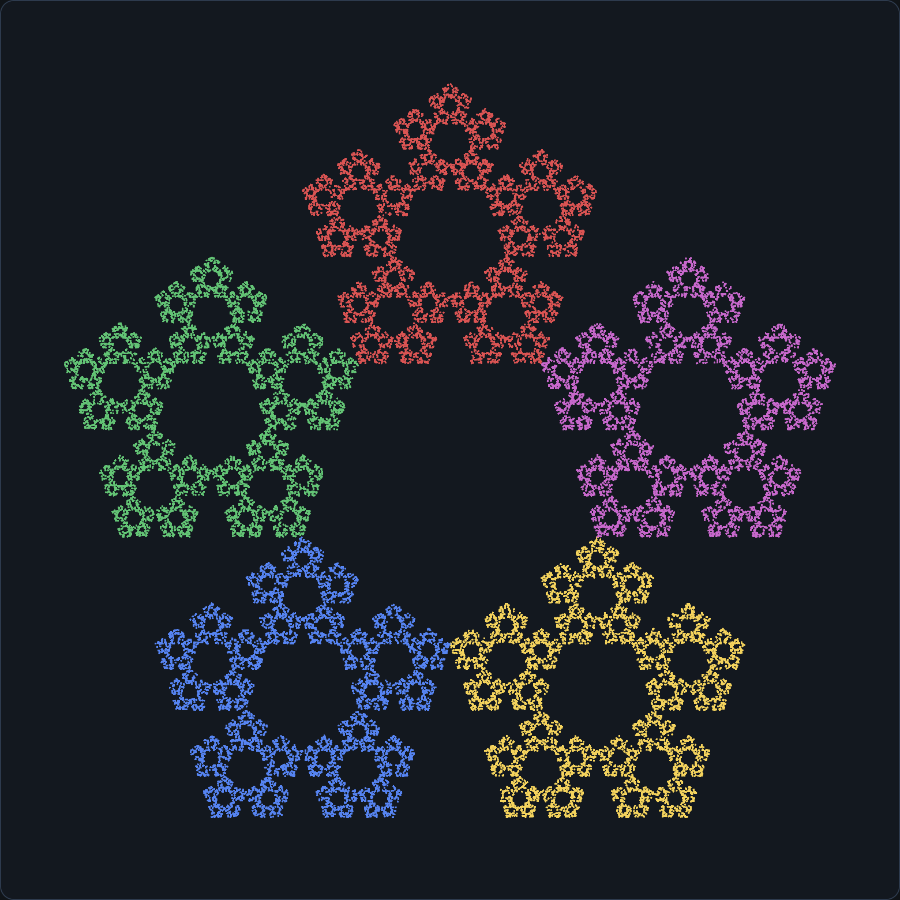
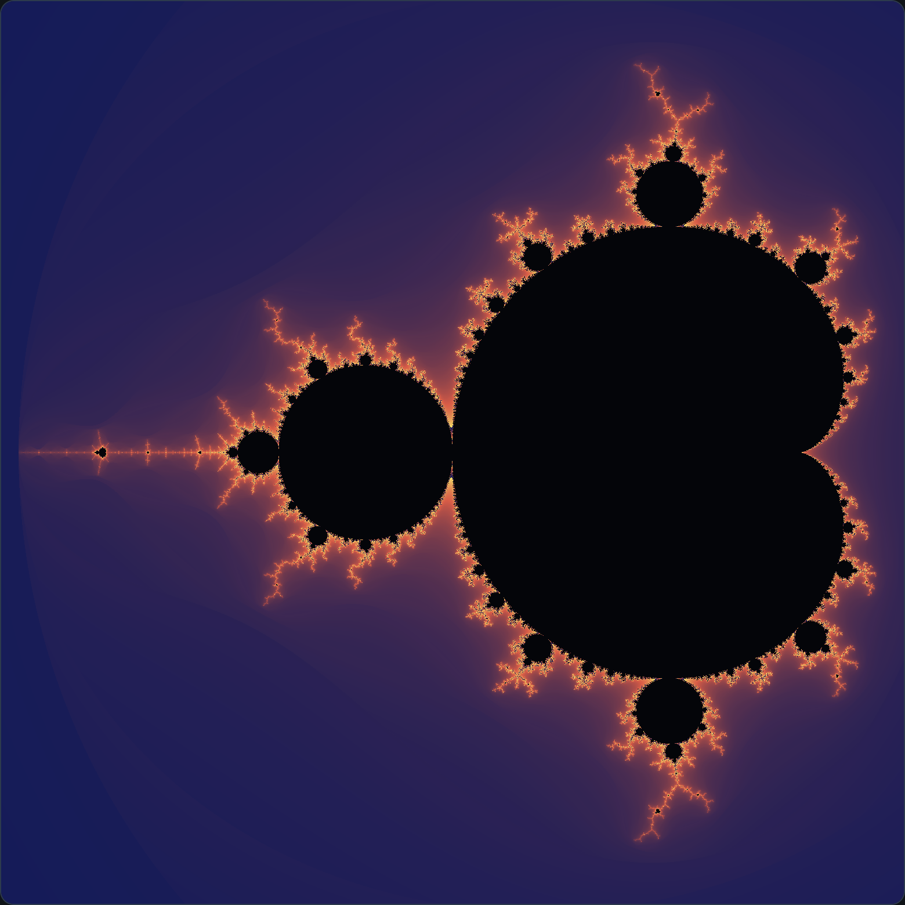
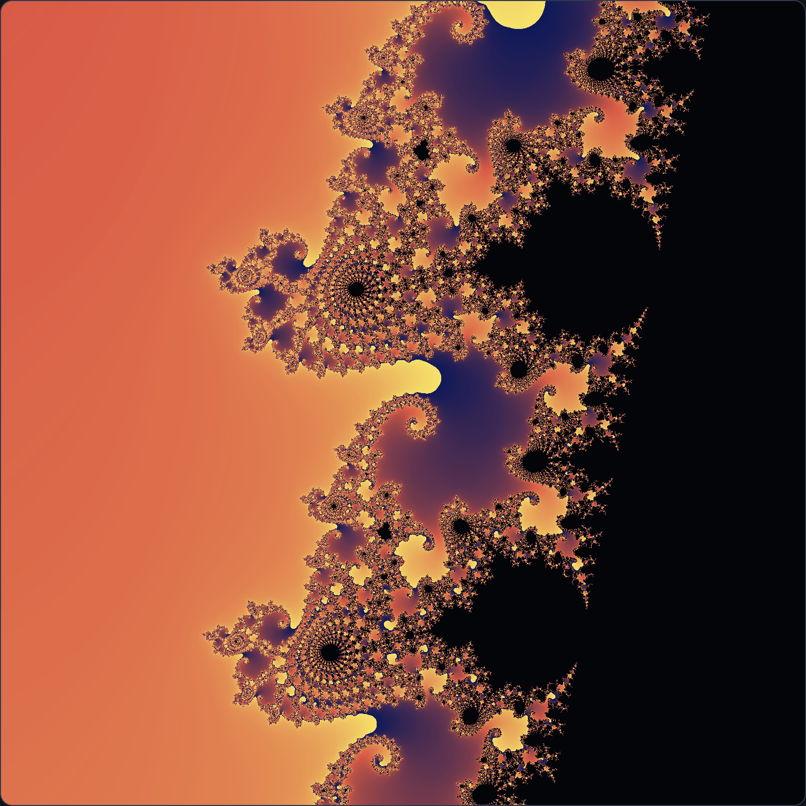
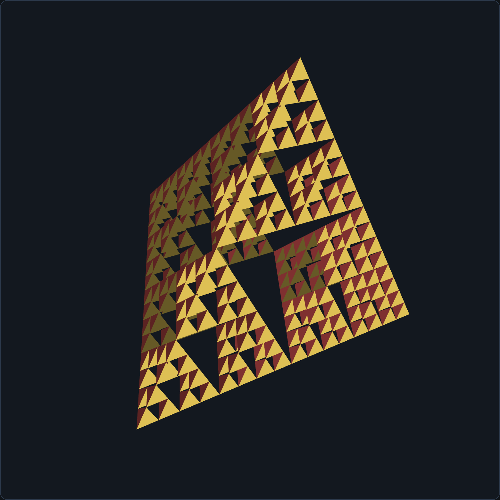

# AP1 · 交互式 2D 分形

WebGL 2.0 作业。用教材 `Common` 库画 Sierpinski 垫片：混沌游戏和递归细分生成同一图形，并完成五边形 / 六边形垫片、Mandelbrot（含 Julia）和 3D 四面体预览。

## 可运行地址

| 方式 | 地址 |
|---|---|
| 公网链接 | https://ztreben.github.io/CGHW/ap1/ |
| 仓库 | https://github.com/Ztreben/CGHW |
| 本机 | http://localhost:5500/ap1/ |

公网页面由 GitHub Pages 从 `main` 分支发布。不要用 `file://` 直接双击 HTML，着色器脚本和 `Common` 库都靠 HTTP 加载。

## 怎么运行

```bash
cd "/Users/zhangzezhen/Desktop/FILE/College/计算机图形学"
npm start
```

看到 `Accepting connections at http://localhost:5500` 后，浏览器打开 http://localhost:5500/ap1/ 。

没有 `serve` 命令时，同样要先 `cd` 到上面的目录，再执行：

```bash
python3 -m http.server 5500
```

### 源码包

`AP1-source.zip` 解压后应同时有 `ap1/` 和 `Common/`（`initShaders.js`、`MV.js`、`webgl-utils.js`）。在这一层启动静态服务器，再打开 `/ap1/`。页面里的脚本使用 `../Common/...`，两个文件夹必须保持并列。

## 实现了什么

几何、交互、面板、渲染分开写：

| 文件 | 职责 |
|---|---|
| `js/geometry.js` | 混沌游戏、三角形递归细分、四面体细分 |
| `js/interaction.js` | 鼠标拖拽 / 滚轮、键盘 |
| `js/ui.js` | 参数面板 |
| `js/renderer.js` | 着色器、VBO、绘制 |
| `js/main.js` | 把上面几部分接起来，并驱动逐点生长 |
| `index.html` | 页面，以及交给 `initShaders.js` 的着色器 |

着色器是 `#version 300 es`。上下文用 `canvas.getContext("webgl2")`。教材 `webgl-utils.js` 里的 `setupWebGL` 只会创建 WebGL 1 上下文，带不动这版着色器，所以这里只借用它提供的 `requestAnimFrame`。

顶点数据的路径是：JavaScript 里的 `vec2` / `vec3` / `vec4` 数组 → `MV.js` 的 `flatten` 得到 `Float32Array` → `gl.bufferData` 上传到 VBO → `vertexAttribPointer` → `gl.drawArrays`。

### 混沌游戏

初始点在多边形内部随机取。之后反复执行

```text
p ← s·p + (1−s)·随机顶点
```

`s = 0.5` 时就是教材里的 `p ← (p + 顶点) / 2`。前 24 次迭代不画，避免起点还没落到吸引子上。默认 20000 个点，面板最少 5000。点的颜色对应该次选中的顶点。

三角形和递归细分用同一组顶点，所以两种算法得到的是同一个垫片。

### 递归细分

`subdivide(triangle, depth)` 取三边中点，只保留三个角上的小三角形，中间那块丢掉。深度 `d` 得到 `3^d` 个三角形。深度 0–6 都可调；深度 6 是 729 个三角形。

同一组三角形可以换成三种图元：

- 点云：`gl.POINTS`
- 线框：每条边拆成 `gl.LINES`
- 实体：`gl.TRIANGLES`

三个角分别用配色方案里的前三种颜色，更深的层次继承所在角的颜色。

### 逐点生长

点云从 0 个点画到设定数量，大约两秒长完。空格暂停或继续；已经长完时再按空格会从头重播。线框和实体直接画完整几何。

### 选做 E1 · n 边形垫片

边数 3–8。收缩比 `s` 用 n-flake 的比例，让小副本刚好相接：

```text
s = 1 / (2 · (1 + Σ cos(2πk/n)))，k = 1 … ⌊n/4⌋
```

| n | s | 看到的东西 |
|---|---|---|
| 3 | 0.5 | 普通 Sierpinski 垫片，和教材中点公式一致 |
| 4 | 0.5 | 中点规则会把正方形铺满，垫片上的大洞消失 |
| 5 | 0.382 | 五个角上各有一块更小的五边形垫片 |
| 6 | 1/3 | 六边形垫片 |

「五边形垫片」「六边形垫片」两个预设会同时改边数、收缩比和点数。把五边形的 `s` 拉回 0.5，可以对比「更密、洞被填上」和「真正的垫片」。选点规则还可以改成不重复上一顶点，或不选相邻顶点。

### 选做 E2 · Mandelbrot / Julia

全屏四边形，在片元着色器里做逃逸时间。`z ← z² + c`，`|z|² > 4` 就算逃出。集合内部涂成近黑，外部用平滑迭代 `n + 1 − log2(log2(|z|²))` 映射到当前配色。

- 拖拽平移复平面，滚轮以光标为中心缩放。
- 「放大到边界」跳到海马谷附近的一处螺旋。
- 勾上「改看 Julia 集」后，`c` 固定，像素坐标变成 `z` 的初值。默认 `c = −0.8 + 0.156i`，实部和虚部可拖。

### 选做 E3 · 3D 四面体垫片

四个顶点构成正四面体。`divideTetra` 只保留四个角上的小四面体，中间的八面体留空。深度 `d` 有 `4^d` 个小四面体，每个画 4 个面。四个面用配色的前四种颜色，并按面法线做了一点明暗，转起来能分出前后。

透视和相机用 `MV.js` 的 `perspective`、`lookAt`、`rotateX`、`rotateY`。拖拽转动，滚轮改变距离，默认为绕竖直轴慢转。点云、线框、实体同样适用。

## 怎么交互

| 操作 | 作用 |
|---|---|
| 场景 | 二维垫片 / Mandelbrot / 3D 四面体 |
| 生成算法 | 混沌游戏或递归细分 |
| 顶点数 | 只影响混沌游戏，5000–80000 |
| 递归深度 | 二维细分和四面体共用，0–6 |
| 点大小 | 点云里的 `gl_PointSize` |
| 配色 | 原色、海洋、暮光 |
| 左键拖拽 | 垫片和平移复平面；四面体是转动 |
| 滚轮 | 以光标为中心缩放；四面体是拉近拉远 |
| 双击或 `R` | 重置当前场景的视图 |
| `1` `2` `3` | 点云、线框、实体。混沌游戏里按 `2` 或 `3` 会改用递归细分。在 Mandelbrot 里按这些键会回到二维垫片 |
| 空格 | 暂停 / 继续逐点生长；长完后再按会重播 |

## 截图

混沌游戏，20000 个点，`s = 0.5`。三个角的颜色对应三次迭代里选中的顶点。



下面三张是递归细分、深度 5（243 个三角形）的三种渲染模式。

点云：



线框：



实体：



五边形垫片，`n = 5`，`s ≈ 0.382`，40000 个点：



Mandelbrot 集全貌，以及放大到边界之后的螺旋：





3D 四面体垫片，深度 4，实体模式。侧面能看出厚度，正面的洞是细分时去掉的部分：



## 引用

- Edward Angel, Dave Shreiner, *Interactive Computer Graphics*, 8th ed. 第 2 章的 Sierpinski 垫片：混沌游戏和递归细分的算法结构。代码按这个思路写的。
- `Common/initShaders.js`、`Common/MV.js`、`Common/webgl-utils.js` 是教材配套库。矩阵、向量、`flatten` 和动画帧都来自这里。
- n 边形的收缩比用的是 n-flake 的公开缩放公式，这样 `n = 3` 时自然变成 `1/2`。
- Mandelbrot / Julia 的逃逸着色是自己写的片元着色器。
