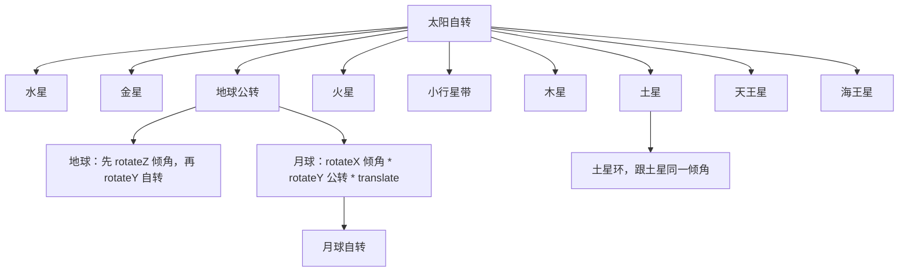
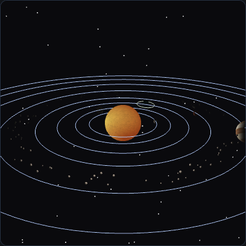
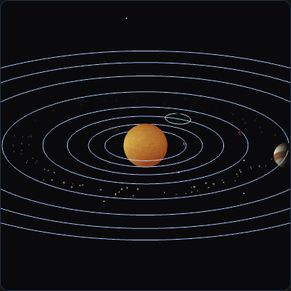
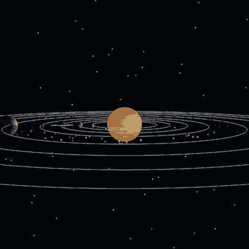
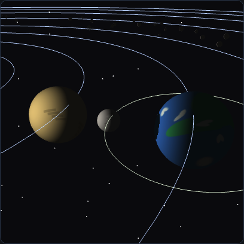

# AP2 · 三维层级场景：太阳系

WebGL 2.0。太阳、八大行星、月球、土星环和小行星带。矩阵用教材 `MV.js` 的 `rotate` / `translate` / `scale` / `mult` 组合，不用封装好的一整颗行星变换。

## 可运行地址

| 方式 | 地址 |
|---|---|
| 给老师的公网链接 | https://ztreben.github.io/CGHW/ap2/ |
| 本机 | http://localhost:5500/ap2/ |

在课程目录执行 `npm start` 后再打开本机地址。不要用 `file://`。

## 层级

地球的模型矩阵是 `公转 * 倾角 * 自转 * 缩放`。倾角在公转的右侧，所以先倾斜地轴，再把地球送到轨道上。若把倾角乘到公转左边，被抬起来的是轨道半径，地球会离开公转平面。



月球不挂在地球自转上，只挂在地球公转后的位置上，否则月球会跟着地球一天转一圈。

## 手动矩阵

月球轨道面倾角不用复合函数，只把三个基本矩阵乘起来。作用顺序从右往左：

```text
place       = translate(距离, 0, 0)
revolution  = rotateY(公转角)
incline     = rotateX(5.14°)
轨道矩阵     = incline * revolution * place
世界矩阵     = 地球公转矩阵 * 轨道矩阵
```

`place` 把月球放到轨道半径上，`revolution` 让它在未倾斜的平面里公转，`incline` 再把整个轨道面绕 X 轴掀起。日食把公转角固定成 180°，月球落到太阳和地球之间；月食固定成 0°，地球挡在太阳和月球之间。

## 纹理

太阳、地球、月球以及其余行星都是画在 canvas 上的位图，经 `gl.texImage2D` 上传，球体带 `aTexCoord`。上传前打开 `UNPACK_FLIP_Y_WEBGL`。Canvas 的原点在左上角，v 向下增大；WebGL 纹理的 v 向上增大。不翻转的话，地球两极会上下颠倒，北极的白冠会贴到南极。

## 投影

`O` 在透视和正交之间切换，相机位置不变。正交的视景体宽度按当前距离和半视角估算，所以两种投影看到的范围接近，差别来自投影本身。

透视里，近处的轨道线更疏、更弯，远处的轨道挤在一起，近大远小。正交里，各层轨道的间距更均匀，平行于投影面的圆仍然是圆，没有近大远小。





## 漫游和轨迹球

空格开始环绕漫游。路径是 8 个关键帧，相邻帧用平滑插值。再按空格暂停或继续。漫游时按下鼠标，相机会切到虚拟轨迹球：把前后两个鼠标位置投到单位球上，叉积是旋转轴。拖拽之后漫游让出控制权。`R` 回到初始视角。滚轮改变距离。

十秒漫游录屏：



## 日食和月食

太阳在原点，片元光照方向是从行星指向太阳的反方向，所以向阳面亮、背阳面暗。日食时若从表面射向太阳的光线先撞上月球，漫反射会被压暗，月球在地球上留下影子。月食则把地球当成挡光球，月球进入地球影子。



## 操作

| 操作 | 作用 |
|---|---|
| 公转 / 自转滑条 | 全体公转、自转的快慢 |
| 轴倾角 | 只改地球，默认 23.5° |
| 轨道线 | 行星轨道和月球的倾斜轨道 |
| `O` | 正交 / 透视 |
| `空格` | 漫游开始、暂停、继续 |
| 拖拽 | 虚拟轨迹球，并接管漫游 |
| 滚轮 | 距离 |
| 日食 / 月食 | 把地月摆到一条线上并换到对应视点 |

## 文件

`js/system.js` 放天体参数和层级矩阵，`js/camera.js` 放投影切换、漫游和轨迹球，`js/interaction.js` 管鼠标键盘，`js/ui.js` 管面板，`js/renderer.js` 管 VBO 和绘制，`js/textures.js` 生成位图。

## 引用

- Edward Angel, Dave Shreiner, *Interactive Computer Graphics*, 8th ed. 第 4 章变换组合，以及 Virtual Trackball 的投影到球面再取旋转轴。
- `Common/MV.js`、`initShaders.js`、`webgl-utils.js` 为教材配套库。
- 行星纹理是作业里用 canvas 画的，不是外部贴图。
