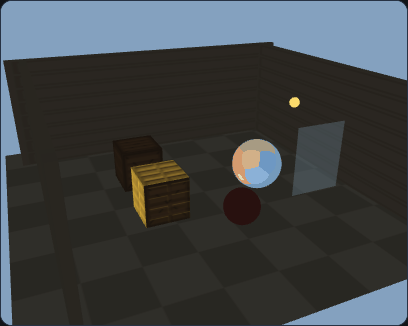
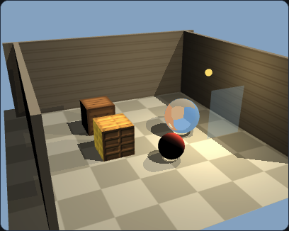
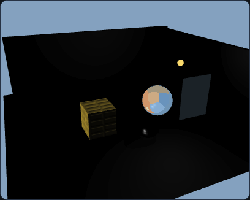
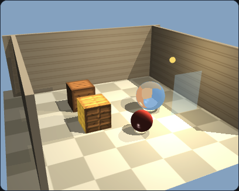
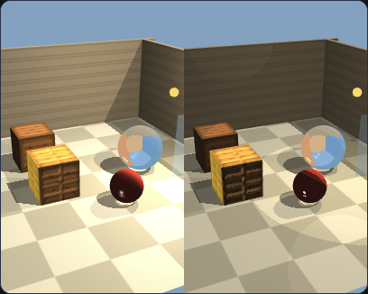

# AP3 · 光照与纹理场景

WebGL 2.0。一个开口的庭院：地面、三面墙、两只木箱、陶瓷球、金属球、玻璃板和一盏点光源。方向光和点光源都会在地面上留下阴影贴图。

## 可运行地址

| 方式 | 地址 |
|---|---|
| 给老师的公网链接 | https://ztreben.github.io/CGHW/ap3/ |
| 本机 | http://localhost:5500/ap3/ |

在课程目录执行 `npm start` 后再打开本机地址。

## Phong

片元着色器里分别算环境光、漫反射和镜面反射。环境光强度、漫反射颜色、镜面强度、高光指数都是 uniform，选中物体后由右侧滑条修改。三个勾选框可以单独关掉某一项。

只开环境光时没有明暗和影子，颜色只跟环境强度有关：

只开漫反射时能看到明暗交界和地面上的影子，高光没有了：

只开镜面时画面几乎是黑的，只留下高光：

三项一起打开：

方向光来自斜上方。点光源就是场景里那颗小黄球，距离越远衰减越强。金属球上的天空颜色来自环境贴图，不由这三个开关决定。

## 纹理和 UV

木箱、地面和墙用 canvas 位图，`gl.texImage2D` 上传。木箱每个面的四个角 UV 是 `(0,0) (1,0) (1,1) (0,1)`。光栅化时 UV 被插值，片元着色器执行 `texture(uAlbedo, vTex)`，再乘上材质的漫反射颜色。

前面那只木箱还会采样法线贴图：高度图用砖缝算出来，变成切线空间法线，再乘 TBN 矩阵。后面那只木箱贴同一张颜色图，但不用法线贴图，砖面更平。勾选框可以关掉前面木箱的法线贴图，两只箱子就能直接对比。

## 环境贴图

金属球用立方体环境贴图。六张天空画布分别传给 `TEXTURE_CUBE_MAP` 的六个面。反射方向是 `reflect(视线, 法线)`，再用 `texture(uCube, R)` 取样。滑条「环境反射」控制它和 Phong 颜色的混合比例。

## 阴影贴图

每个光源各有一张深度纹理和 FBO。

1. 第一遍从光源看场景，只写深度。方向光用正交投影，点光源用透视投影。深度 FBO 没有颜色附件。
2. 第二遍正常画。片元的世界坐标乘光源的视图投影矩阵，变到 `[0,1]` 后和深度图比较。比深度图更远，就是在阴影里，漫反射和镜面会被压暗。

「方向光阴影范围」改正交视景体的大小，太小会把影子裁掉，太大则深度精度变差、边缘更锯齿。「深度偏移」用来压阴影痤疮；偏得太大时，影子会和物体脱开。玻璃和发光小球不写入阴影，避免透明片把后面整片涂黑。

点光源的影子是第二张阴影贴图，只覆盖灯照向庭院中心的那个视锥。灯背后的地方不会被这张图挡住。

## 透明

玻璃板的 alpha 小于 1。不透明物体画完之后再画它，打开 `blend`，混合系数是 `SRC_ALPHA, ONE_MINUS_SRC_ALPHA`，并且关掉深度写入，这样能看见后面的球和地面。

## Phong、Blinn–Phong 和卡通

着色模型可以选择 Phong、Blinn–Phong 或卡通。Blinn–Phong 用半角向量 `normalize(L + V)` 代替反射向量。卡通把漫反射量化成三档，高光用阈值切成一块。勾上并排对比后，左半边固定是 Phong，右半边是当前选中的模型。

## 拾取

点击时先把场景画进一张离屏颜色缓冲，每个物体一种纯色，再 `readPixels`。颜色对上哪个物体，面板就改成那个物体的环境强度、漫反射颜色、镜面强度、高光指数、透明度和环境反射。选中的物体会多一圈边缘高光。并排对比时不拾取，避免左右两半坐标对不上。

拖拽超过几个像素算转视角，不算点击。滚轮缩放。

## 文件

`js/scene.js` 放物体和材质，`js/geometry.js` 放立方体、平面和球，`js/renderer.js` 放 Phong、两张阴影贴图和拾取，`js/interaction.js` 管鼠标，`js/ui.js` 管面板，`js/textures.js` 生成位图、法线贴图和立方体贴图。

## 引用

- Edward Angel, Dave Shreiner, *Interactive Computer Graphics*, 8th ed. 第 6 章 Phong，第 7 章纹理与反射贴图，第 8 章阴影贴图，第 3 章颜色编码拾取。
- `Common/MV.js`、`initShaders.js`、`webgl-utils.js` 为教材配套库。
- 贴图都是本页用 canvas 生成的，不是外部图片。
